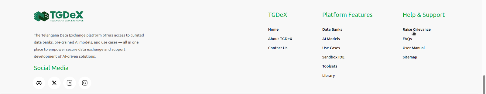
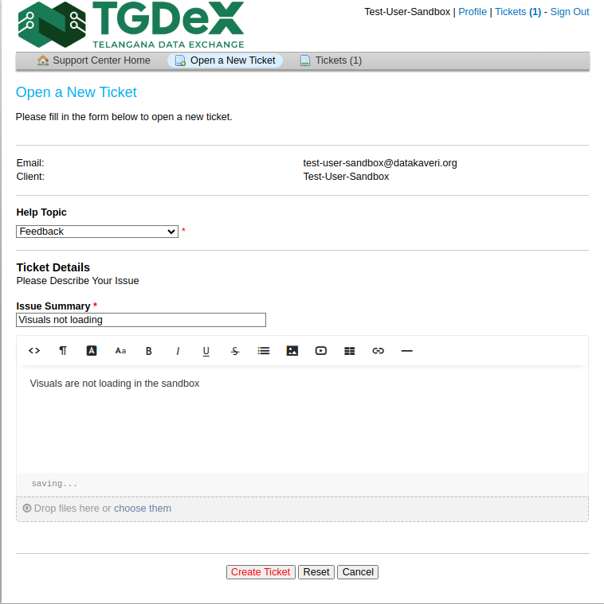
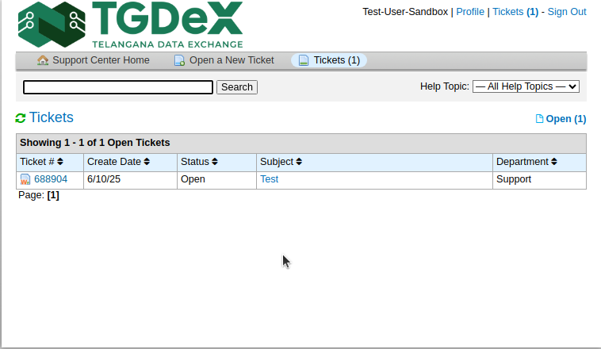
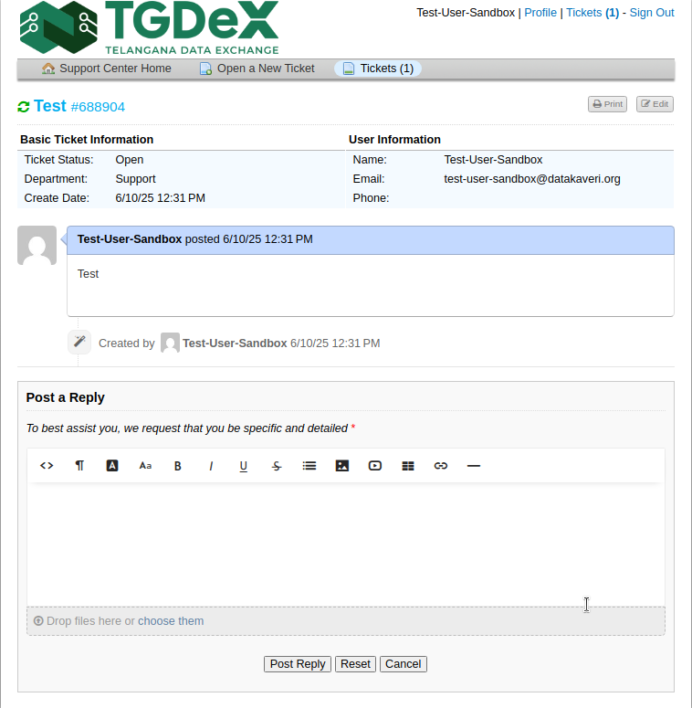

# Grievance Redressal System

---

## Overview

The Grievance Management module leverages osTicket, an open-source ticketing system, to capture, track, and resolve public and stakeholder grievances efficiently. It ensures transparency, accountability, and timely redressal by following a structured process: from receipt to resolution, with clear escalation and reporting mechanisms.

---

## Issue Submission

### Raising a Grievance

1. Scroll down to the footer of the Telangana Data Exchange portal
2. Under Help & Support, click **"Raise a Grievance"**

> **Note:**
> - **Registered users**: Must log in first
> - **Guest users**: Can proceed without registration, just provide your email to submit a ticket

### Open a New Ticket

1. Click on the **Open a New Ticket** button
2. **Help Topic**: Choose from categories like:
   - Feedback
   - General Inquiry
   - Report a problem/Access Issue
3. **Issue Summary** (required): A short, clear title of your grievance
4. **Ticket Details**: Provide full details including context, affected data, etc.
5. **Upload**: Attach screenshots or documents to support your case

 

---

## Ticket Submission & Status Tracking

- After submitting, you will receive a confirmation message and an auto-email with your ticket number
- **If you had logged in before raising a ticket**: Click on **"Tickets"** to view all of your created tickets
- **If you created a ticket as a guest**: Click on **"Check Ticket Status"**, enter your email and ticket number, and you will receive an email access link to check your ticket status

---

## Basic Ticket Information

Once the ticket status page loads, you'll find the following:

- **Ticket Number**: The number generated when the ticket is created
- **Create Date**: Date of ticket creation
- **Ticket Status**: Indicates the current phase:
  - **Open** – Ticket is open
  - **Resolved** – Agent marked the issue resolved, pending confirmation
  - **Closed** – Issue formally closed
- **Subject**: Subject of the ticket while creating the ticket
- **Department**: Shows who's handling the grievance

---

## Ticket Thread

- To open the ticket thread, click on either the **"Ticket Number"** or **"Subject"**
- The thread of replies by you and the agent will show up
- Additional messages/details can be provided to the agent

---

For unresolved issues, users can:
- Raise formal complaints using the Grievance Redressal form
- Reach out to support-tgdex-itc@telangana.gov.in
