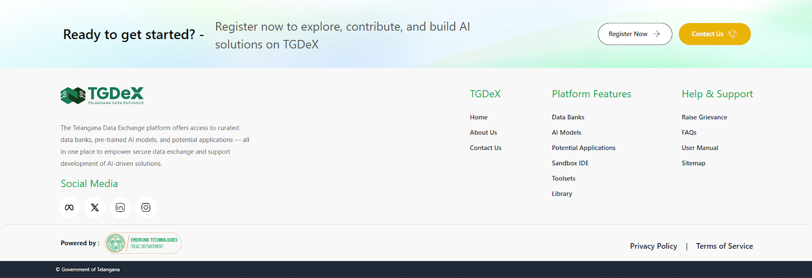

## Call to Action & Footer

At the bottom of the Home Page, a prominent banner prompts users to **Register Now** or **Contact Us**, encouraging them to join the TGDeX community, explore Data Banks, AI Models, and Potential Applications, and start building AI solutions.

The footer reinforces the platform’s identity with quick navigation links:

**TGDeX:** Home, About Us, Contact Us  
**Platform Features:** Data Bank, AI Models, Potential Applications, Sandbox IDE, Toolsets, Library  
**Help & Support:** Grievance, FAQ, User Manuals, Sitemap

It also includes:
- The TGDeX logo with a brief description of the platform’s mission
- Social media icons: Facebook, X, LinkedIn, Instagram
- Legal links: Privacy Policy and Terms of Service

  
*Call to Action and Footer section*
