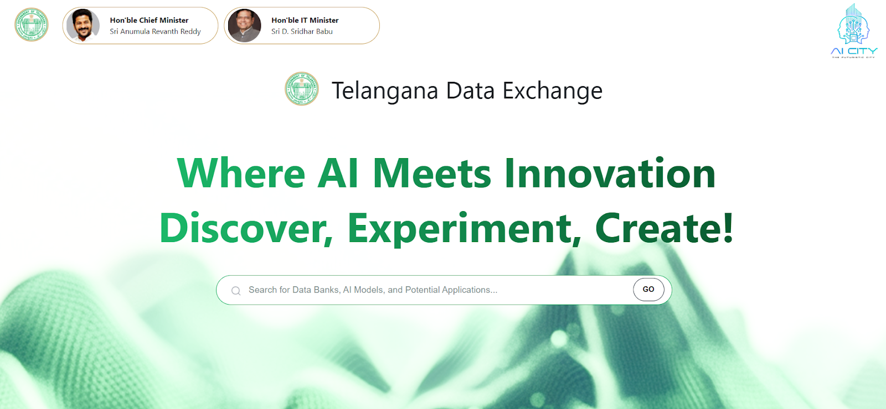

## Hero section and Global search

The Hero section welcomes users with the TGDeX tagline—“Where AI Meets Innovation” and “Discover, Experiment, Create!”—set against a clean background to draw attention to the platform’s core promise. Centrally positioned is the global search bar, where users can enter keywords to discover Data Banks, AI Models, and Potential Applications. As users type, the search suggests matching items grouped by category, and a single click on **Go** delivers a unified results page. This combination of a bold, engaging header and an intelligent, all-in-one search tool ensures users can immediately find and act on the resources they need.

  
*Hero section and Global search bar Section*

## Ecosystem Partners

This section emphasizes TGDeX’s role as a unifying hub, where government, industry, and academia join forces to advance AI-driven innovation for Telangana.

  
*Collaborators section with logos Section*

## Core TGDeX Features

This section introduces the four core pillars that power TGDeX’s data-driven innovation: Data Banks, AI Models, Potential Applications, and Sandbox IDE. Each pillar is represented by a clickable card—simply select **Explore…** to dive into the module of your choice.

  
*The TGDeX Features Section*
