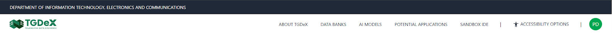

# Navigation Bar

The navigation bar spans the top of every TGDeX page, providing one-click access to all primary modules and key account actions:

### TGDeX Logo
Click to return to the Home Page from anywhere in the platform.

### About Us
Opens the overview page detailing TGDeX’s vision and core values.

### Data Banks
Direct link to browse, search, and filter available Data Banks.

### AI Models
Takes users to the gallery of pre-trained AI Models, with options to download them.

### Potential Applications
Takes users to a gallery of Potential Applications showcasing real-world use cases to inspire AI innovation.

### Sandbox IDE
Launches the in-browser development environment for coding, testing, and training AI workflows.

### Accessibility Options
Toggle features like high-contrast mode, text resizing, and screen-reader support to customize viewing experience.

### Sign in / Register
Initiates the process to log in or create an account and join the TGDeX community.

### User Icon
Displayed after users log in, the User Icon links directly to their personal dashboard and activity center.

This fully responsive bar adapts to desktop and mobile views, collapsing into a hamburger menu on smaller screens while keeping all items within easy reach.

  
*Pre-Login Navigation Bar*

  
*Post-Login Navigation Bar*
