# AI Models

AI Models are ready-to-use, pre-trained machine learning models shared on TGDeX. Users can download these models or test them directly on the platform to solve specific tasks like text classification, image recognition, or prediction.

---

## AI Models Listing Page

The AI Models Listing page provides a central hub for discovering, evaluating and accessing pre-trained AI Models. Users can quickly locate the right model via the search bar, refine the list with sort and filter controls, and review key details on each model’s card before diving into model-specific documentation or testing environments.
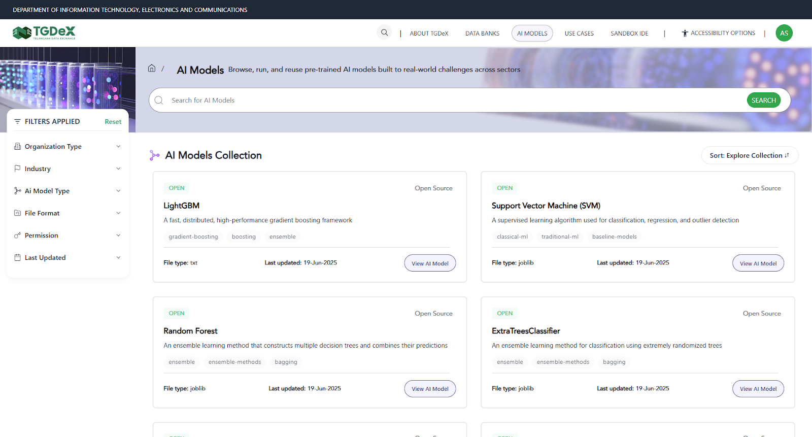

### AI Model Search
Positioned at the top of the page, the AI Models search bar lets users enter keywords (e.g., “translation,” “disease detection”) to instantly narrow the AI Models list.
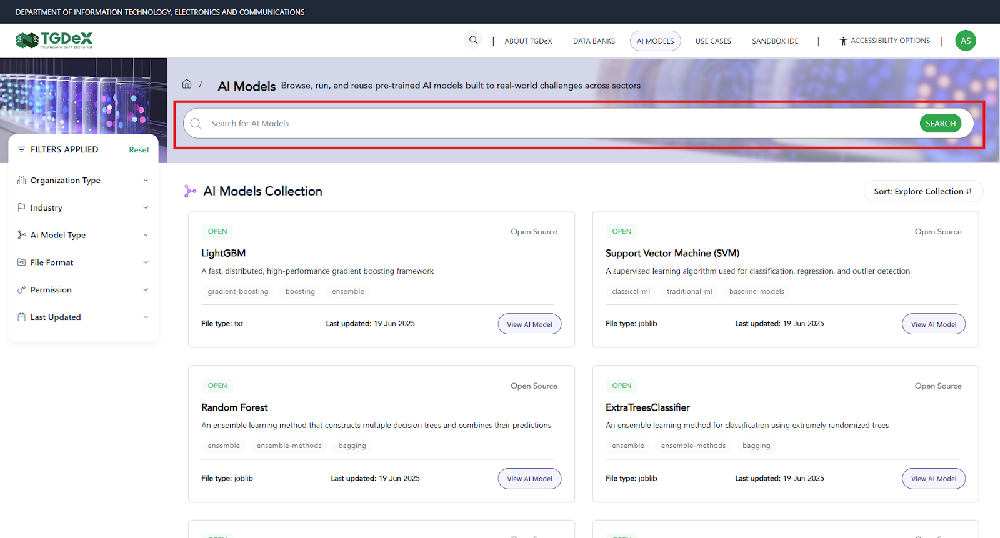

### Sort Feature
- To the right of the search bar is a sort menu that reorders the model cards based on:
  - **A–Z / Z–A**: Alphabetical by model name
  - **Old to New/New to Old**: Shows AI models in ascending/descending order of upload date.
  - **Popular Downloads**: Models with the highest download counts
  
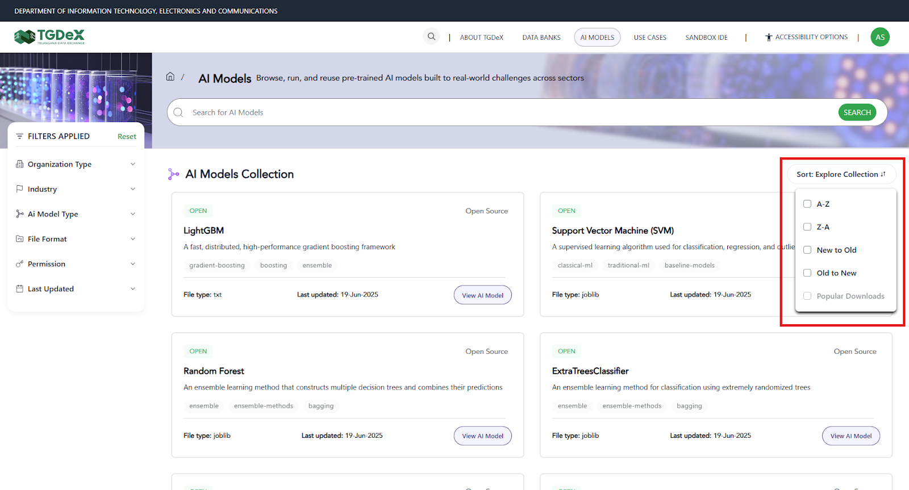

- Selecting an option immediately refreshes the listing in the chosen order

### Filter Feature
The AI Model filter panel enables users to narrow the model listing by multiple criteria:
- **Organisation Type**:
  - All: Includes AI models from every source.
  - Public: AI models published by government departments or publicly funded entities.
  - Private: AI models contributed by private companies or startups.
  - Academic Institution: AI models originating from universities and research institutes.
  - Other: AI models from NGOs, community groups or any other type of organization.
- **Industry**: Applying an industry filter limits results to AI Models tagged under those sectors. Type to search or select one or more industries—such as Healthcare, Financial Services, Agriculture, Manufacturing, Energy, Education and more.
- **AI Model Type**: AI Model categories such as Text Classification, Image Classification, Object Detection, Named Entity Recognition, Speech-to-Text, Text Summarization, Sentiment Analysis, Time Series Forecasting, Clustering, Anomaly Detection, Recommendation, Language Translation, Question Answering, Text Generation, Semantic Search, and many more.
- **File Format**: This filter helps in listing AI models with specific file formats
  - Traditional ML: PKL, JOBLIB, SAV, RDS
  - Deep Learning (TensorFlow / Keras): HDF5, PB, TFLITE, KERAS
  - Deep Learning (PyTorch): PT, PTH, CKPT
  - Cross-Framework / Optimized: ONNX, SAFETENSORS, TRT
  - Enterprise/Interchange: MLMODEL, TFLITE, PMML, JSON, BIN
  - Other
- **Permission**:
  - Open: Publicly available AI models with immediate download access.
  - Restricted: AI models requiring approval or elevated permissions to download.
- **Last Updated**: Restrict results to AI models updated in last 7 days, last 30 days, last 1 year or within a custom date range.

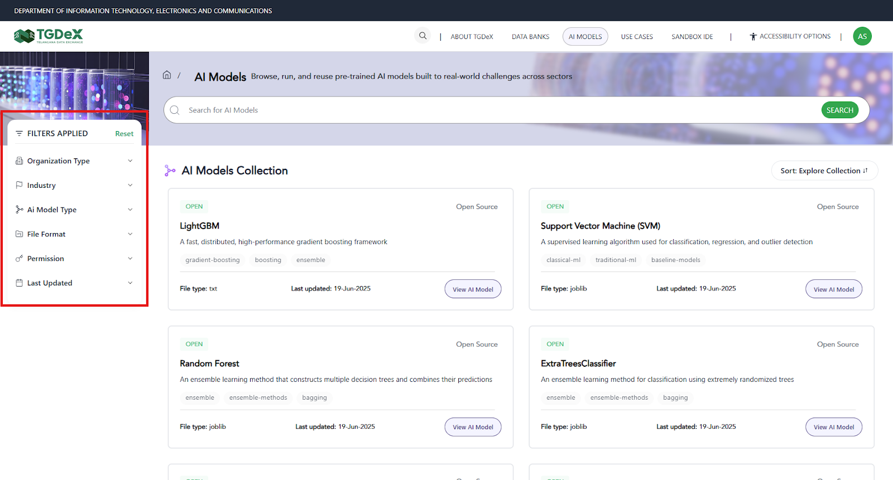

### AI Model Card
Each AI model card provides a snapshot of the following key information:
- **Access Status** - "Open" or "Restricted" badge
- **Publishing Organization**
- **Title**
- **Short description**
- **Tags**
- **File format**
- **Last updated date**
- **Action Button**: "View AI Model" to open the full details and download options

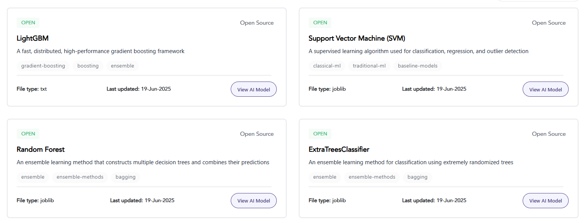

---

## AI Model Details

When users select an AI Model card, they arrive at the Model Detail page, which is organized into the following sections:

### Page Header & Actions
- **Breadcrumb Trail**: Shows “Home / AI Models / [Model Name]” so users know their location.
- **Model Title & Permission**: The model’s name (e.g., “Telugu Grievance Classification Model”) is accompanied by an Open or Restricted badge.
- **Download Button**: For Open models, users can immediately download the model archive; for Restricted models, this button becomes active once access is granted.
### Description 
- A concise summary describing the model's purpose, key capabilities.
### Tags
- Keywords (e.g., "Grievance," "Classification") that show the model's domains and functions.

### AI Model Details Panel
A structured metadata table presents:
- **Organisation**: The government department, agency or entity that has the ownership of the published AI model.
- **Industry**: The sector classification—such as Public Services, Healthcare or Agriculture—that indicates the model’s primary domain, if any. If model is not associated to any industry, it is depicted as sector agnostic
- **Uploaded By**: The individual or team (and their organisation) that submitted the model to TGDeX.
- **Model Permission**: Access level (Open or Restricted)
- **Last Updated**: Timestamp of the most recent update of the model
- **License**: Governing usage terms (e.g., Apache 2.0)
- **Model Type**: Task category (e.g., Text Classification)
- **File Type**: Format of the model bundle (e.g., Safetensors)
- **File Size**: Download size of complete model repository

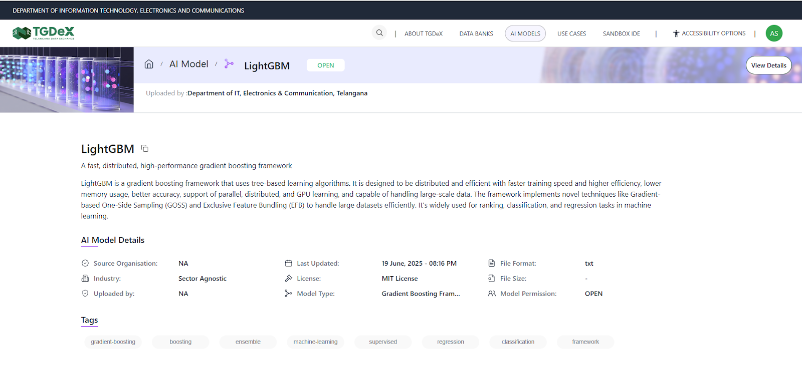

---

## AI Model Upload

### Step 1: Click on ‘Start adding AI Model’ and then, set up your AI model.
1. **AI Model Title**: Enter a concise, descriptive name that clearly reflects the model's function (e.g., "Telugu Grievance Classification Model")
2. **AI Model Permission**:
   - **Open**: The model is publicly accessible—any user can download or invoke it immediately without approval.
   - **Restricted**: Access requires approval from the publisher of that particular AI model.
   - **Private**: The model is visible and usable only by the publisher. 
3. **Metadata Entry Options**:
   - **Enter Metadata Manually**: Opens a form where you have to fill short/long descriptions, tags and structured fields from scratch.
   - **Import from JSON**: Upload an existing TGDeX-compatible JSON manifest to pre-populate all metadata fields—ideal for automated workflows or bulk model registrations.

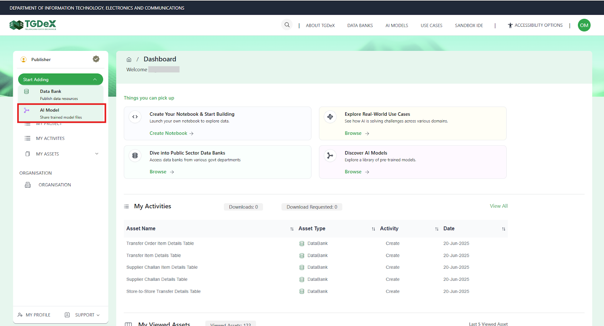
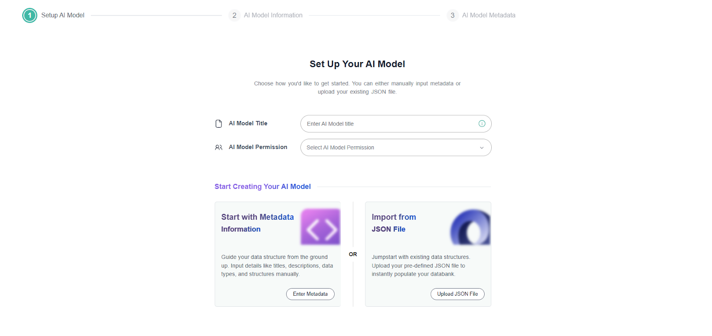

### Step 2: Provide AI Model Information
Once the basic setup is complete, fill in the model’s descriptive and structured metadata:
- **Short Description**: A One- or two-sentence summary of the model's task and capabilities
- **Tags**: Add up to five keywords that aid discovery (e.g., “Text Classification,” “NLP,” “Grievance”).
- **Long Description**: In the long description, users should clearly explain what the model is meant to do, what kind of input it takes and what output it gives. They should also mention key features like support for different languages, the ability to customize outputs. Finally, it’s helpful to describe how the model can be used or where it can be applied.
- **AI Model Details**:
  - **Organisation**: The government department, agency or entity that has the ownership of the published data bank.
  - **Organisation Type**: Public, Private, Academic, NGO/Non-profit, or Other
  - **Uploaded By**: Please mention your user name, team name or organization
  - **License**: Legal terms governing model reuse (e.g., Apache 2.0).
  - **File Size**: Approximate download size (e.g., 100 MB).
  - **Model Type**: AI task category (Text Classification, Object Detection, etc.)
  - **File Format**: Bundle format(s) supported (SAFETENSORS, ONNX, PKL, etc.)
  - **Industry**: Select sector classification—such as Healthcare or Agriculture—that indicates the model’s primary domain, if any. If model is not associated to any industry, please select sector agnostic.
  - **Media URL**: URL link for the AI Model (e.g., GitHub link)

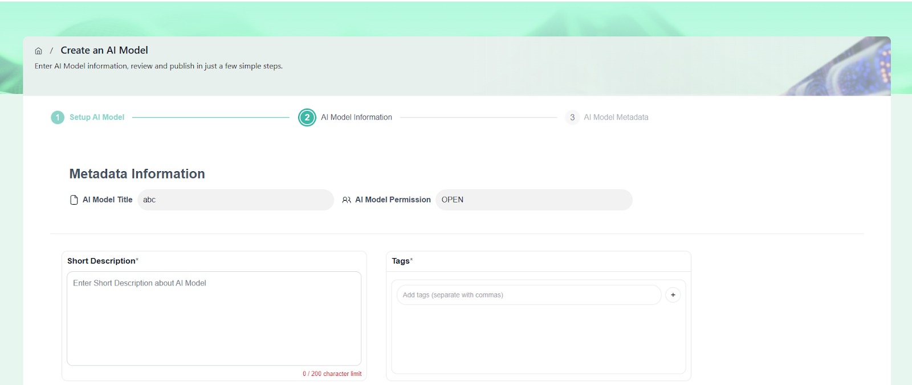

### Step 3: Upload Your AI Model
If the user provides a Media URL, the AI model will be created automatically in Step 2. However, if no Media URL is entered, the user will be directed to Step 3 to proceed with manual file upload. In this step, users must upload the relevant files according to the file format selected in Step 2. They have the option to upload multiple files using the "Upload More" button. Additionally, users can clear or delete any previously uploaded files and upload new files or an entirely new set using the **Clear All** button.
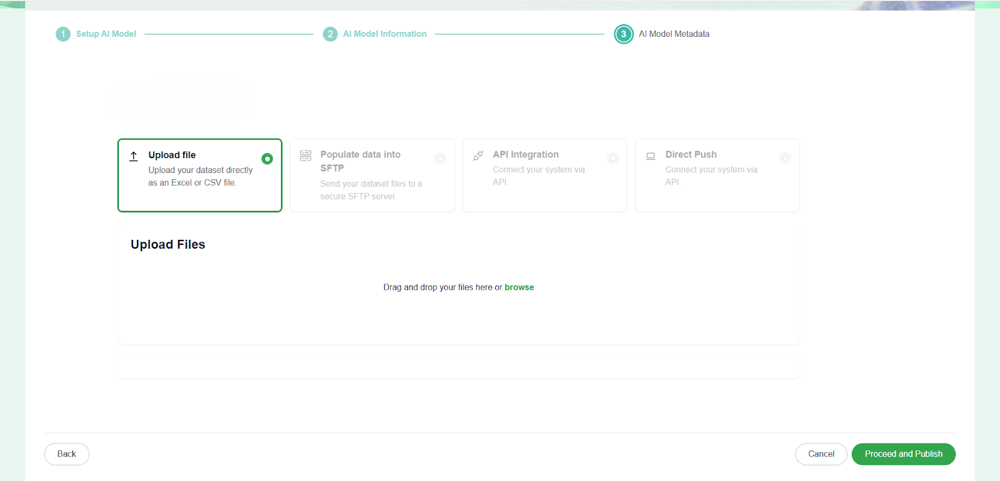

### Step 4: Review and Publish
Before publishing, review all details including the short and long descriptions, tags, metadata fields, and uploaded files to ensure accuracy. Confirm that the correct permission level is selected. Once everything is verified, click Publish to proceed.Open Models go live immediately and are discoverable by all users

### Step 5: Approval
Approval requests are sent to the Organisation Manager for review. Once they approve, the AI model gets published on the AI Model listing page.

---

## AI Model Download

- **Open**: For 'Open' AI models, users can simply click the **Download** button on the model detail page. The model file is immediately packaged and begins downloading without any additional steps or approvals.
- **Restricted**: For 'Restricted' AI models, users must first request access by clicking the **Request Access** button on the detail page. A form will appear prompting the user to provide a brief justification. Once submitted, the request is sent to the model's publisher or organisation manager for approval. After approval, the user receives an email notification and the **Download** button becomes active on the detail page, allowing them to retrieve the model file.
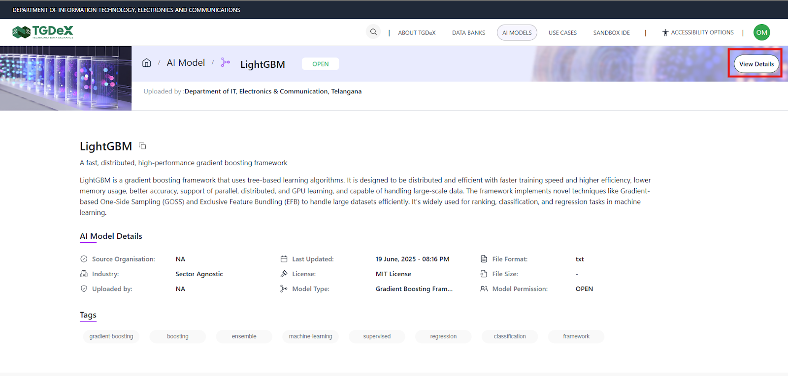
