# Data Banks

Data Banks are collections of datasets made available on TGDeX. These may include information like health records, satellite imagery, public service logs, or other structured/unstructured data that can be used for analysis, research, or building AI solutions.

---

## Data Banks Listing Page

The Data Banks Listing page offers a consolidated view of all available Data Banks, complete with a search bar, sorting options and a collapsible filter panel (by organization type, department, access status and more) to help users pinpoint relevant assets. Each Data Bank is presented as a card showing its title, publisher, readiness score, file type, access level and a brief description, with a “View Data Bank” button to access full details or download options.

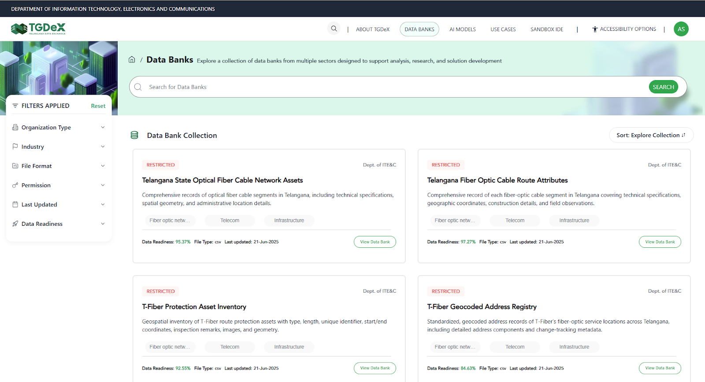

### Data Banks Search Bar
Positioned at the top of the Data Bank Listing page, the search bar lets users enter keywords to quickly locate specific Data Banks. As users type, it offers instant suggestions and filters the displayed cards to match titles, descriptions or tags, streamlining the discovery process.
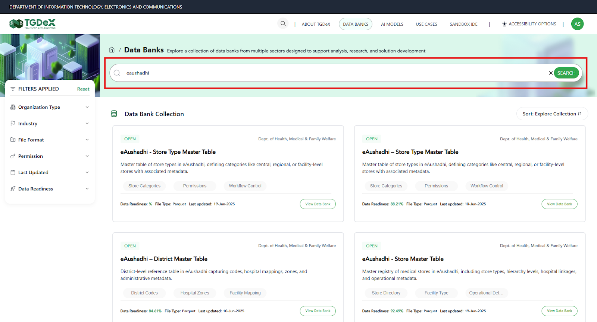

### Sort Feature
The sort feature lets users reorder the Data Bank cards based on different criteria:
- **A–Z / Z–A**: Alphabetical ordering by Data Bank title.
- **Old to New/New to Old**: Shows Data Banks in ascending/descending order of upload date.
- **Popular Downloads**: Ranks Data Banks by download count to highlight the most-used resources at the top.

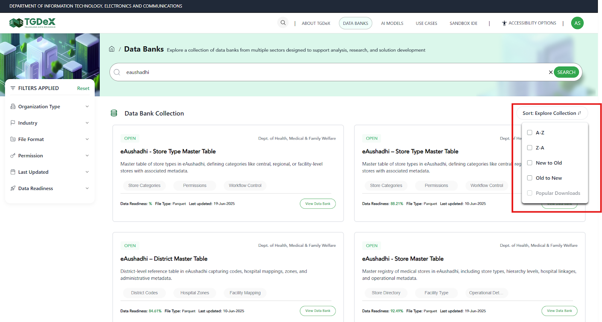

### Filter Feature
The filter panel is divided into several sections, each allowing users to narrow the Data Bank listing according to specific criteria:
- Organization Type:
    - All: Includes Data Banks from every source.
    - Public: Data Banks published by government departments or publicly funded entities.
    - Private: Data Banks contributed by private companies or startups.
    - Academic Institution: Data Banks originating from universities and research institutes.
    - Other: Data Banks from NGOs, community groups or any other type of organization.
- Industry: Applying an industry filter limits results to Data Banks tagged under those sectors. Type to search or select one or more industries— such as Healthcare, Financial Services, Agriculture, Manufacturing, Energy, Education and more.
- Access Status:
  - Open: Publicly available Data Banks with immediate download access.
  - Restricted: Data Banks requiring approval or elevated permissions to download.
- File Type: Choose from formats like CSV, PDF, TXT, Shapefile, image files etc. Selecting multiple types returns any Data Bank offering at least one of the chosen formats.
- Data Readiness: Use predefined ranges (e.g., 0–20%, 20–40%, 40–60%, 60–80% and greater than 80%) to filter by data readiness and usability of data bank to build AI models. Higher readiness score indicates more fully documented and clean Data Banks.
- Last Updated: Restrict results to data banks updated in last 7 days, last 30 days, last 1 year or within a custom date range.

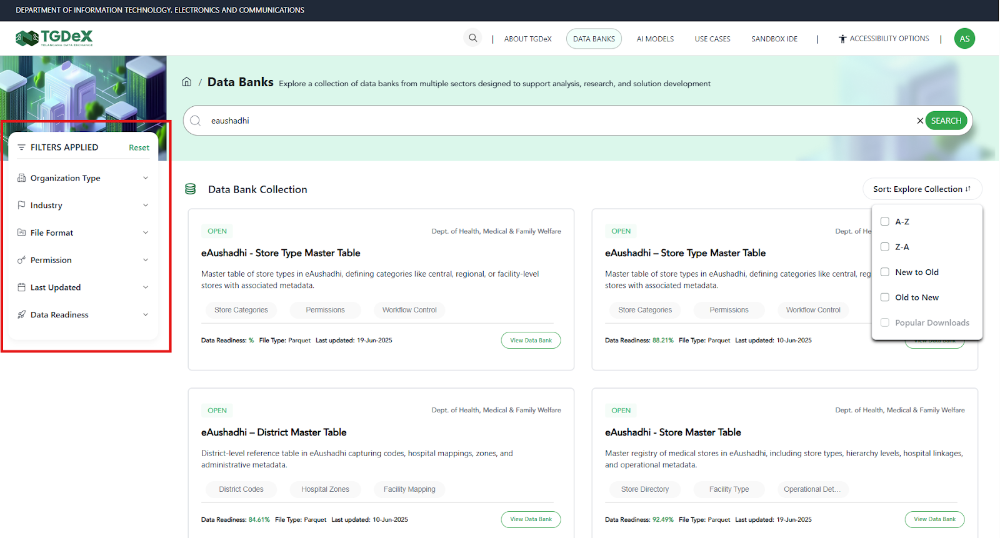

### Data Bank Card
Each Data Bank card provides a snapshot of key information:
- **Access Status** - "Open" or "Restricted" badge
- **Publishing Organization**
- **Title**
- **Short description**
- **Tags**
- **Data Readiness score**
- **File format**
- **Last updated date**
- **Action Button**: "View Data Bank” to open the full details and download options.

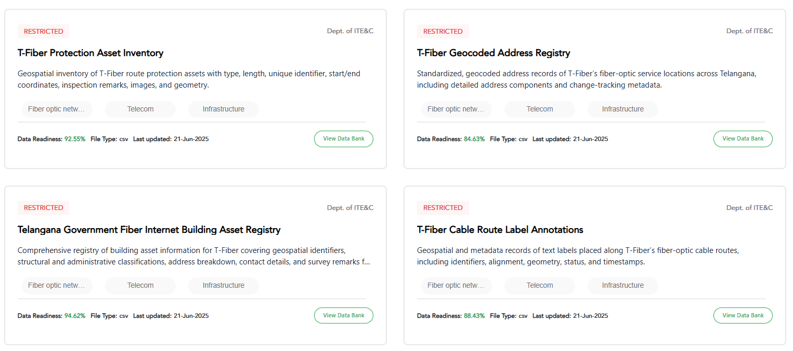

---

## Data Bank Details

Each data bank comprises a comprehensive metadata panel that describes the asset's origin, usage scope, access rules, and quality indicators. This information helps users assess relevance and technical suitability before downloading or integrating the data bank into their projects.

**Metadata fields shown:**
- **Title**: Name of the data bank
- **Long description**: The long description section provides an in-depth narrative about the Data Bank, offering context that goes beyond the basic metadata fields. It can outline the type of records (e.g., antenatal visit history, diagnostic results, vital signs) and the data sources (such as public health centers or hospitals). It can also suggest potential use cases, ideal audience and indicate on type on possible analyses that can be performed using the data bank.
- **Organisation**: The government department, agency or entity that has the ownership of the published data bank.
- **Industry**: The sector classification such as, healthcare, mobility etc. that indicates the data bank’s primary domain.
- **Uploaded By**: The user or team (or their organisation) that submitted the Data Bank to TGDeX.
- **Geo Coverage**: The geographic extent of the data (e.g., “State-level (Telangana)”).
- **Year Range**: The temporal span of the records contained in the data bank (e.g., 2018–2024).
- **Data Bank Permission**: Access level—Open (no restrictions) or Restricted (requires approval)—that governs download and use.
- **Last Updated**: Date and time when the Data Bank was most recently refreshed.
- **File Format**: The downloadable format(s) provided (e.g., CSV, TXT, PDF).
- **License**: The legal terms under which the Data Bank is made available (e.g., Telangana Open Health Data License v1.0).
- **Upload Frequency**: How often the data bank is updated (e.g., Quarterly, Monthly, One-time).
- **Data Readiness**: A data readiness score (percentage) that reflects completeness, documentation and cleanliness of the data bank.
- **Verified By**: The role or individual—typically the Organisation Manager—who reviewed and approved the Data Bank for publication.

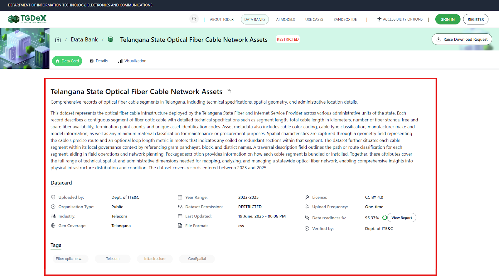

### Data Bank Details & Preview
This page is split into two main areas - Version Files panel on the left and the Data Bank Viewer on the right.
- **Left Panel**:
  - Version Files: A collapsible list of all available file versions and associated file (e.g. annotation files of corresponding data bank). Users can expand folders and click individual files to download.
  - File size: Size of the selected file in the data bank is displayed here.
  - Last Updated: Timestamp of the upload date and time of the selected file is displayed.
  - License: The data license governing use.
- **Right Panel**:
  - Preview Table: An interactive snapshot of the dataset showing first few rows and columns of the selected data bank file.
  - Column Descriptors Toggle: Enabling this option displays key statistics for each column—such as data type, record count, minimum, maximum, mean and standard deviation—so users can quickly assess the dataset’s structure and quality.
  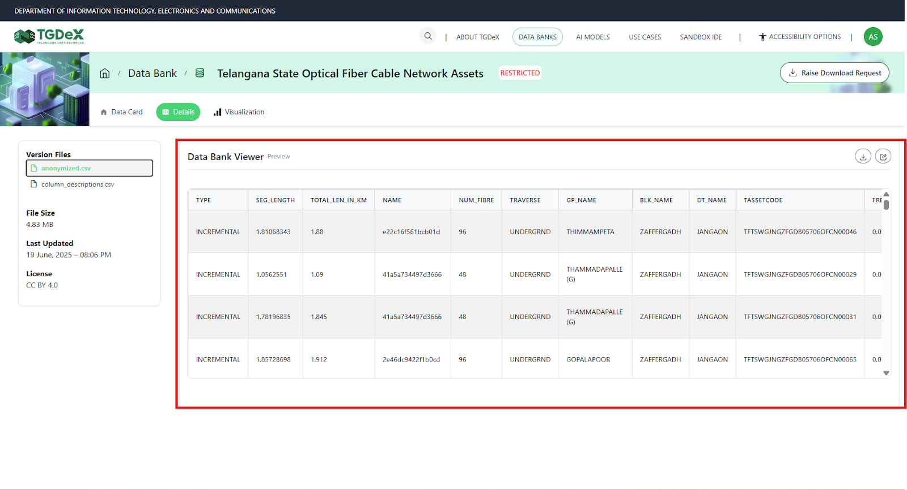

### Data Visualization
The Visualization panel lets users create basic charts directly from the Data Bank—no coding required. By selecting one or more columns as the X-axis (dimensions) and additional columns as series (metrics), users can generate column, line or pie charts. Download button also enables users to export the chart. Key components:

- **Chart Type Selector:** Choose between Column, Line or Pie charts.
- **X-Axis / Series Picks:** Click Add dimension to set the horizontal axis, add series to plot one or more metrics.
- **Download:** Export visualization as an image.

---

## Data Bank Upload

### Step 1: Click on **Start adding Data Bank** and set up your data bank:
1. **Enter Title & Permission:**
   - **Data Bank Title**: Give your dataset a clear, descriptive name.
   - **Data Bank Permission**: Choose from following in the drop down:
     - Open: Viewable/downloadable by all registered users
     - Restricted: Users can view data bank but downloadable only upon publisher’s approval
     - Private: Data Bank is not viewable/ downloadable by anyone, meant for personal use
2. **Choose Metadata Entry Method:**
   - Enter Metadata Manually: Fill in all fields via the form
   - Import from JSON: Upload your metadata using an existing template file

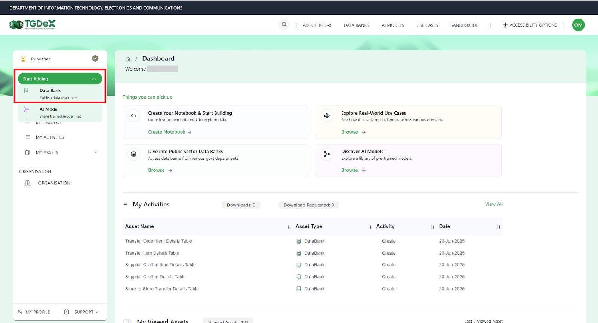
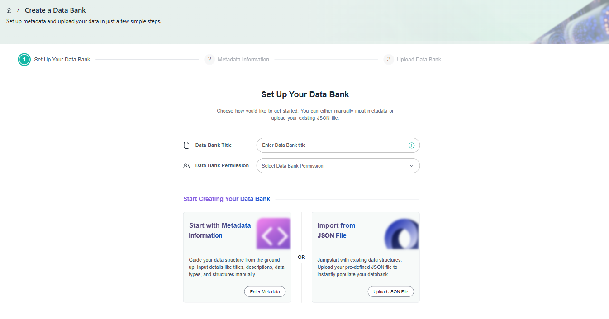

### Step 2: Enter Metadata Information
1. Under metadata Information, fill out each mandatory field:
   - **Short Description**: A one- or two-sentence summary of the data bank’s content and purpose.
   - **Tags**: Add tags (e.g., "Community Health," "Satellite Imagery") to aid discovery.
   - **Long Description**: Provide an in-depth narrative about the Data Bank, offering context that goes beyond the basic metadata fields. It can outline the type of records (e.g., antenatal visit history, diagnostic results, vital signs) and the data sources (such as public health centers or hospitals). It can also suggest potential use cases, ideal audience and indicate on type on possible analyses that can be performed using the data bank.
   - **Organisation**: The government department, agency or entity that has the ownership of the published data bank.
   - **Industry**: The sector classification such as, healthcare, mobility etc. that indicates the data bank’s primary domain.
   - **Year Range**: The temporal span of the records contained in the data bank (e.g., 2018–2024).
   - **Data Bank Type**: Choose from catalogued types – structured/semi-structured/unstructured.
   - **Uploaded By**: Autofilled using your existing details.
   - **Upload Frequency**: How often the data will be updated (Daily, Weekly, Monthly, Annually, One-time).
   - **Geo Coverage**: Geographic extent (e.g., State-level Telangana).
   - **License**: Legal terms governing reuse.
   - **Organisation Type**: Public, Private, Academic, or Other
   - **File Format**: Format of data bank file which is being uploaded (CSV, TXT, PDF, GeoJSON, Shapefile, etc.).
   - **Link Related Assets**: Add Associated Data Banks or Add Associated AI Models to create pre-defined connections between your new Data Bank and other platform content.

### Step 3: Upload Data Bank
The user should upload the relevant files according to the file format selected in Step 2. Users can upload multiple files using the "Upload More" button. Additionally, users can clear or delete any previously uploaded files and upload new files or an entirely new set using the **Clear All** button.

### Step 4: Review and Publish
After your files finish uploading, you’ll be taken to a summary page displaying all metadata fields and tags you entered, list of uploaded files and their preview (if uploaded data is structured). Carefully verify each detail—move back to the respective section to correct any information. When everything looks correct, click Publish.

### Step 5: Approval
Approval requests are sent to the Organisation Manager for review. Once they approve, the data bank gets published on the TGDeX Data Bank listing page.

---

## Data Bank Download

Depending on a Data Bank's permission level, the steps to download differ slightly:

- **Open Data Banks:**
  1. Click the **Download** button on the data bank details page
  2. The entire Data Bank (all files and folders) is packaged into a single ZIP archive and begins downloading immediately

- **Restricted Data Banks:**
  1. Click the **Request Access** button on the data bank details page
  2. A request form pops up; add a brief justification for why you need access.
  3. Submit the request—TGDeX notifies the data bank's publisher
  4. Once approved, you'll receive an email notification, and a **Download** button appears in the details page.
  5. Click **Download** to retrieve the full Data Bank
  
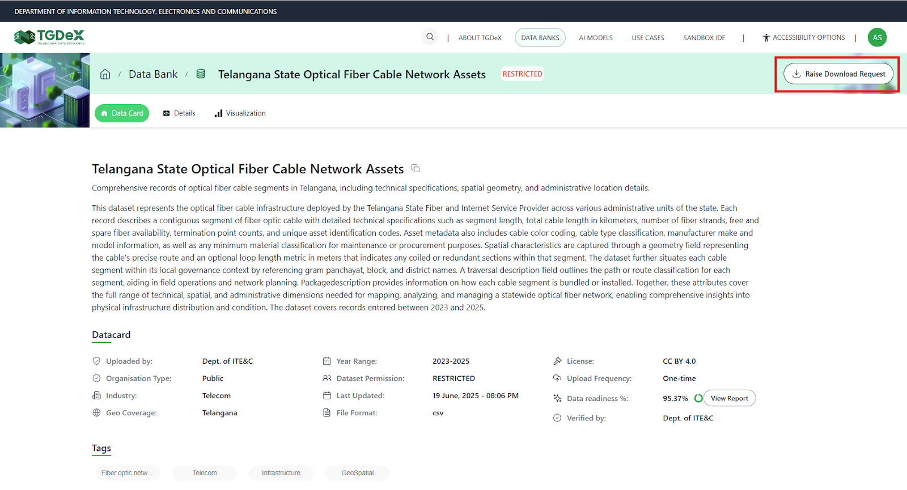
---

## Using Data Bank in Sandbox IDE

Once the Sandbox IDE has been instantiated, you will see a templated starter notebook with the following information:

- Type of notebook instance - CPU only or GPU instance
- The available resources for that notebook - Available CPU cycles and Available RAM, Available VRAM (in case of GPU notebook)
- Started TGDeX SDK instantiated (with imports)

The started TGDeX SDK requires you to input your credentials and the databank of interest and fetches the Databank of interest into your workspace.

You can fetch Data Bank ID from the detail page of that particular data bank by clicking on copy icon.
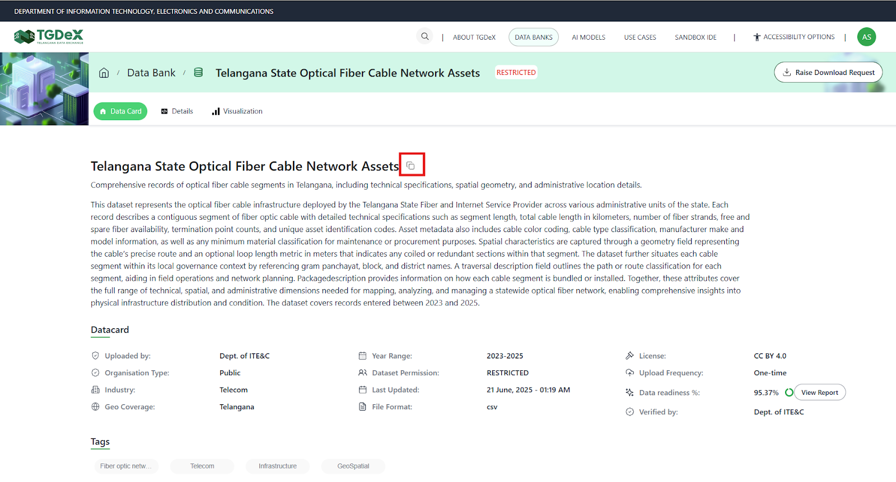
Figure below shows the section of the starter sdk which allows you to download a databank.
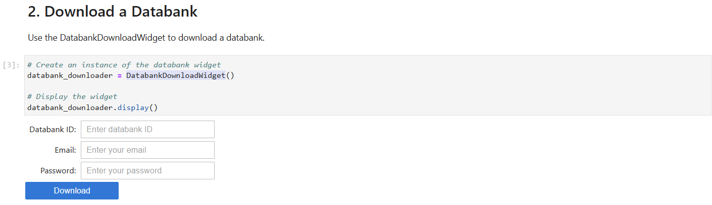
Once the fetching process is complete, you will find the databank of interest in the “In-Notebook” file interface as shown in the figure below.

