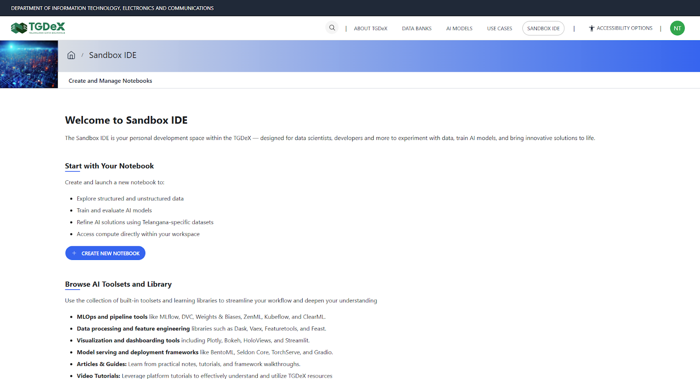
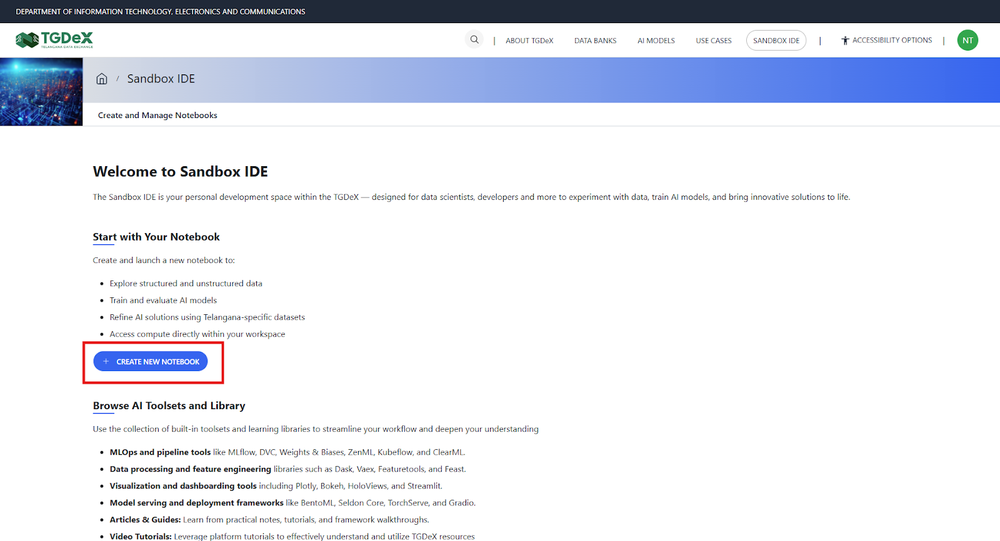
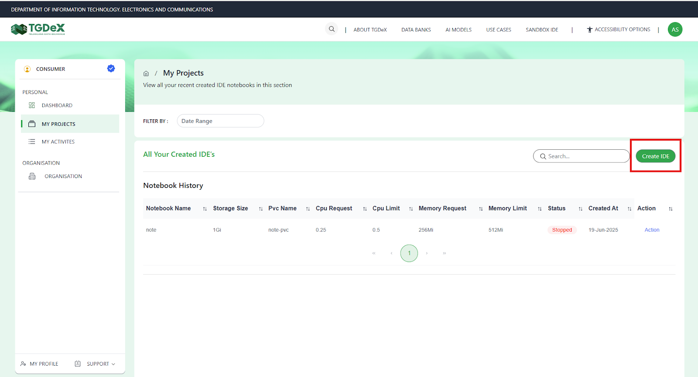
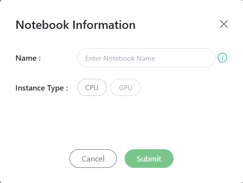
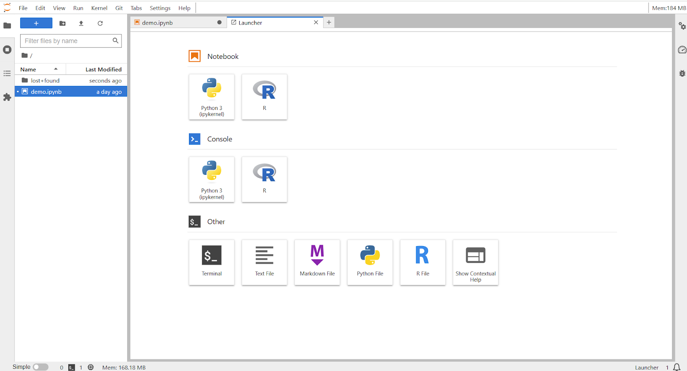
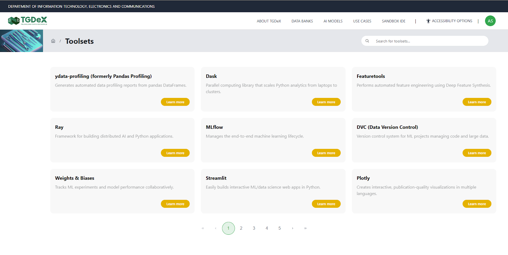
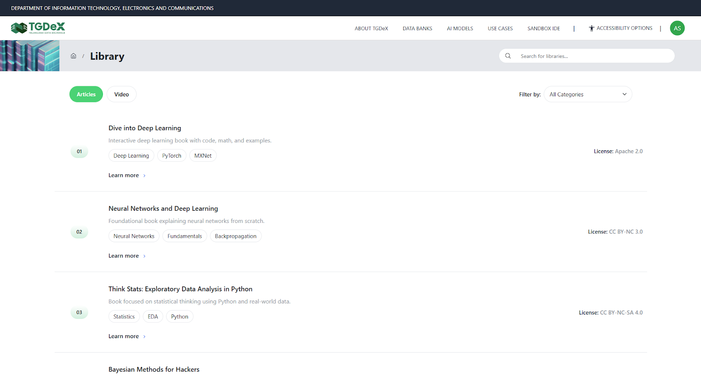

# Sandbox IDE

The Sandbox IDE is a cloud development environment within TGDeX that enables users—especially data scientists, researchers, and developers—to build, test, and deploy AI models using TGDeX data banks and AI resources. It offers secure, compute-enabled notebooks along with access to curated toolsets and learning materials.

---

## Creating Notebooks

To start working in the IDE:
1. Click on **Create New Notebook** from the Sandbox IDE home page.
   
2. Click on **Create IDE button**.
   
3. A pop-up window will prompt the user to:
   - Enter a notebook name. The notebook name should have all small letters with no special characters or spaces in it.
   - Choose an instance type (e.g., CPU or GPU, if available)
   - Click **Submit** to launch the notebook. Once submitted, the user is taken to an IDE interface where they can write and run code.

4. Your IDE notebook will open.
> **Note:** You might need to wait for 1-2 minutes for your notebook to get opened

---

## Requesting GPU-based Compute Resources

This section allows users to apply for GPU-based compute access to support AI model training and development within the Sandbox IDE. Since GPU resources are limited and allocated based on merit, users are encouraged to be as clear, descriptive, and logical as possible while filling out the request form. Applications are evaluated based on project impact, technical need, and alignment of objective with Telangana’s AI mission.
1. Go to **My Projects** section of your profile.
2. Click on **Request GPU Compute** button.
3. Fill in Applicant Information
   - Your name is auto-filled.
   - Answer the question: Are you a member of an organisation registered on TGDeX?
     - If Yes:
       - Enter your Organisation Name, Organisation Type, and Organisation Location (City, State).
       - Provide Organisation Website, your Job Title, and official email ID (business email).
     - If No:
       - Provide your personal email ID and location (City, State).
       - Optionally, add your LinkedIn profile and mobile number.
4. Provide Project Overview - Fill out the following required fields:
   - Project Title
   - Brief Description of your AI model or use case (max 250 words).
   - Select the relevant sector (e.g., Healthcare, Education, Agriculture, etc.).
   - Explain the problem you are solving and what makes your solution innovative.
   - Mention the TGDeX Data Bank you are using.
   - Identify your end users or beneficiaries (e.g., Government, Startups, Citizens).
   - Select the current stage of your project (PoC, MVP, Scaling, etc.).
5. Enter Technical Information for GPU Needs - This section helps TGDeX assess the required resources:
   - Specify the type of AI/ML model (e.g., Transformer, LLM, CNN).
   - Indicate if the model is pre-trained or newly trained.
   - Select the input data type (e.g., image, text, tabular, multimodal).
   - Mention the approximate data volume and add:
     - Number of training iterations/epochs
     - Estimated batch size
   - Specify the estimated GPU hours needed.
   - Write a brief justification explaining why GPU access is required.
   - Optionally, share your preferred time slots for using compute.
   - Confirm whether you've used TGDeX compute before. If yes, provide details of your previous usage.
6. Share Team Credentials - This section is optional but strengthens your request:
   - Indicate your team size.
   - List key team members and roles.
   - Summarise any past AI/ML experience.
   - Upload relevant projects, publications, or recognitions.
   - Mention if you have any government, incubator, or VC support.
   - Optionally disclose your organisation’s valuation.
7. Final Declaration & Submission
   - Tick the checkbox to confirm the accuracy of your information.
   - Acknowledge that GPU allocation is based on evaluation criteria and availability.
   - Click **Submit Request** to complete the process.
---

## Using Compute in IDE

Once compute access is approved, users can launch or switch their notebooks to run on the allocated GPU resources. The notebook automatically connects to the compute backend, allowing users to perform resource-intensive tasks such as model training, evaluation, inference, or fine-tuning directly within the environment.

Approved users are allotted a compute quota (such as GPU hours or sessions), which can be tracked through their dashboard. Each quota comes with an expiration timeline and may be subject to limits based on prior usage and overall platform capacity. Users are expected to use their allocated compute efficiently and are encouraged to request only what they truly need to ensure fair access for all members of the TGDeX community.

Compute usage will be tracked and subtracted from the available quota. Once the available quota for the user is breached, there will be a warning that will flash and all your current work will be saved and notebook will be suspended.

<!--  -->

---

## Leveraging Built-in Toolsets

The Sandbox IDE on TGDeX comes pre-loaded with a wide range of open-source toolsets to support the full AI/ML workflow—from data analysis and feature engineering to model training, deployment, and monitoring. Popular libraries such as MLflow, DVC, TensorBoard, Streamlit, Plotly, and BentoML are available, enabling users to build, track, visualize, and serve models efficiently without additional setup.

---

## Learning Using Library

Users can explore the **Learning Library**, which includes:
- Articles and tutorials on ML techniques, evaluation metrics, and model validation
- Step-by-step notebooks and guides for specific tasks like NLP and computer vision
- Video walkthroughs demonstrating real-world AI applications

---

The Sandbox IDE combines ready-to-use compute, libraries, and learning materials to streamline the end-to-end AI development experience on TGDeX.
