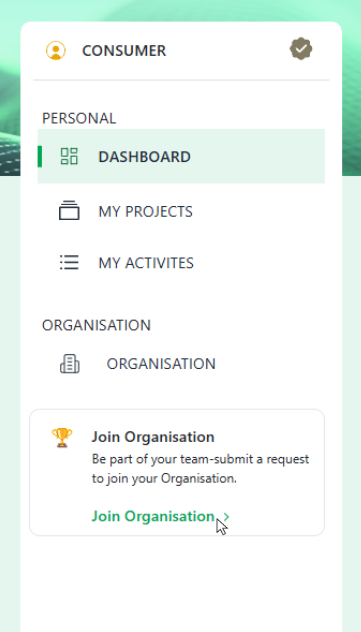
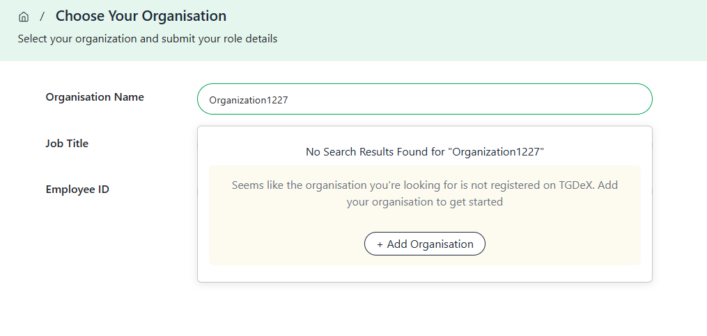
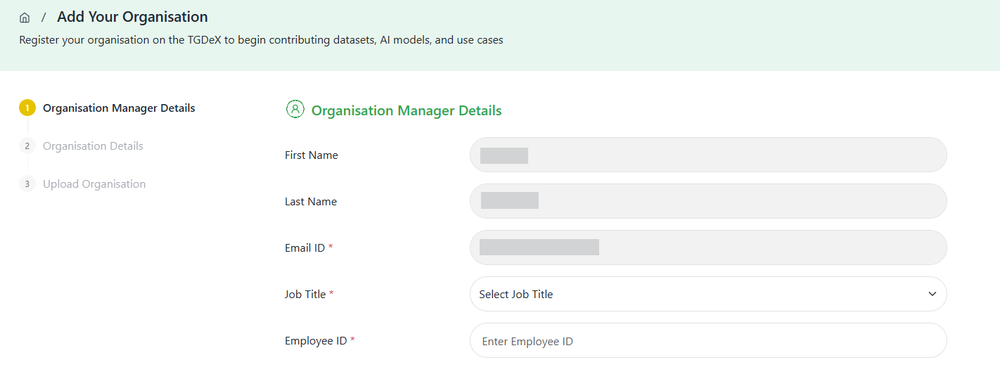

If a user’s organization isn’t yet registered on TGDeX, the user can submit a request to add it by providing organization details and supporting documents. Only a person authorized by that organization may complete this step, since they will assume the sole Organization Manager role. As Organization Manager, the user will have responsibility for adding and managing members, assigning publisher roles, and overseeing all assets published under the organization’s name. Once the organization is approved and the user designated as its manager, no additional Organization Manager accounts can be created for that organization.

**Step 1:** Click on “Join an Organisation” button on your dashboard.

 
*Accessing Join Organisation option*

**Step 2:** Search for your organisation. If no match is found, the system will prompt you with an Add Organisation option. Click it to begin the registration process.

 
*Option to Add Organisation when not found in search*

**Step 3:** You will be redirected to the Organisation Registration form. It includes three sections:

- **Organisation Manager Details:**  
  Fill in your profile information such as name, organisation email, etc.

- **Organisation Details:**  
  Provide details like entity type, sector, organisation name, website, and address.

- **Upload Organisation Documents:**  
  Upload the following required documents:
    - Firm Incorporation Certificate
    - PAN Card of the organisation
    - Authorization document (stating that the user is authorized by their organisation to become an Organisation Manager on TGDeX and manage users and assets on its behalf)
    - Any other supporting document (optional)

 
*Organisation Registration Form with document upload*

**Step 4:** Once the form is completed and documents uploaded, click Submit Details.

[//]: # (![Accessing Join Organisation from the Dashboard]&#40;images/access_join_organisation.png&#41; )

[//]: # (*Accessing Join Organisation from the Dashboard*)

**Step 5:** A confirmation popup will appear indicating that the request has been successfully sent to the TGDeX Platform Administrator for review.

[//]: # (![Accessing Join Organisation from the Dashboard]&#40;images/access_join_organisation.png&#41; )

[//]: # (*Accessing Join Organisation from the Dashboard*)

//need pic for this

After the request is reviewed and approved, the user will be assigned the Organisation Manager role and can begin managing users and assets under the new organisation.

