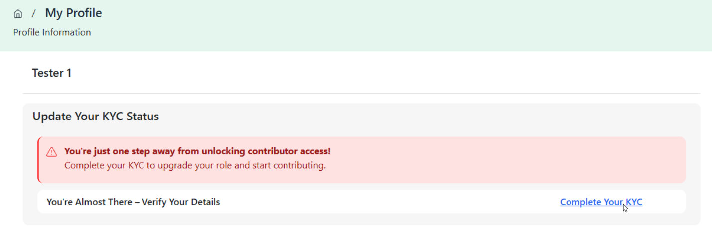
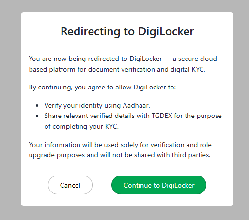
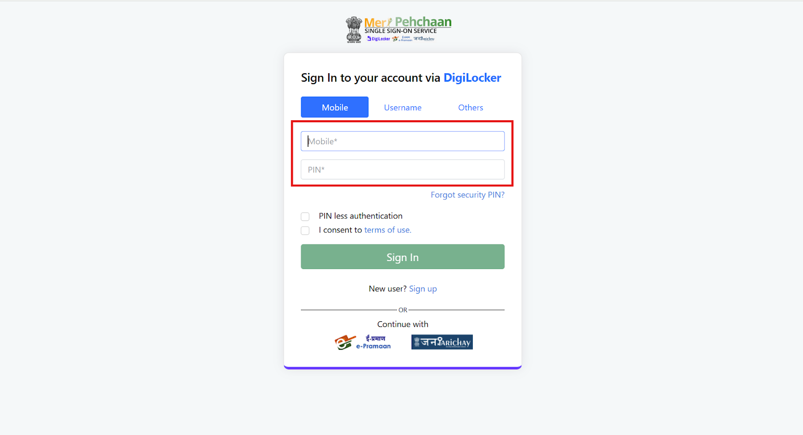
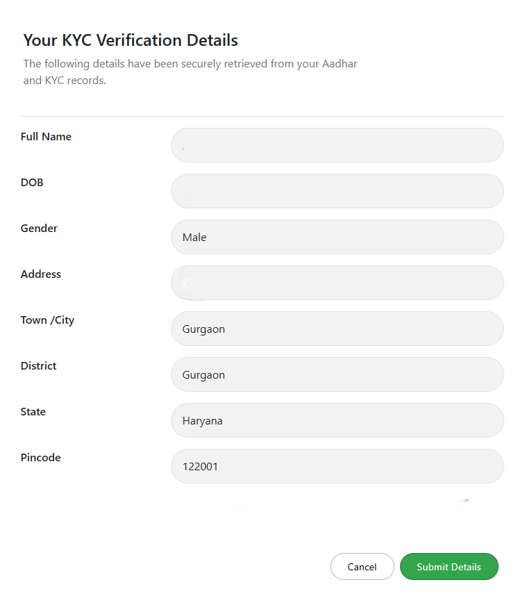
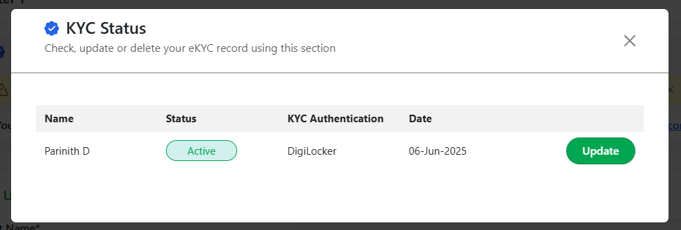

To upgrade their role, access computing resources, or begin publishing Data Banks, AI Models, or Potential Applications, users must complete **eKYC** through DigiLocker. During this digital verification, users grant TGDeX permission to retrieve identity details (name, address, and photo) directly from their DigiLocker account, which is linked to their Aadhaar.

Users can complete their eKYC verification by following the steps outlined below:

**Step 1:** Go to your **My Profile** section and click on **Complete Your eKYC**.  

  
*Clicking My Profile*

  
*Clicking Complete Your KYC*

**Step 2:** A popup will appear informing you that you are being redirected to DigiLocker for verification. Click **Continue to DigiLocker** to proceed.  

  
*Redirecting to DigiLocker consent screen*

**Step 3:** You will be redirected to the DigiLocker login screen. Enter your Aadhaar number and click **Next** to authenticate your identity.  

  
*Entering mobile number in DigiLocker Page*

**Step 4:** Once verified, your details will be securely fetched from DigiLocker. These include your name, phone number, date of birth, gender, and address.  
Confirm that the retrieved details are correct, check the consent box to share your Aadhaar-linked information with TGDeX, and click **Submit Details**.  

  
*Submitting eKYC verification details*

**Step 5:** After successful submission, you can verify your eKYC status under the **KYC Status** section in your profile. This screen displays:
- Name
- Status (e.g., **KYC Verified**)
- KYC Authentication Method (e.g., **DigiLocker**)
- Verification Date
- Actions available (**Update** or **Delete**)

If required, users can update their KYC by clicking **Update**, or revoke their verification by clicking **Delete**.  

  
*Viewing eKYC Status*
