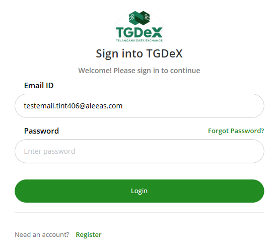
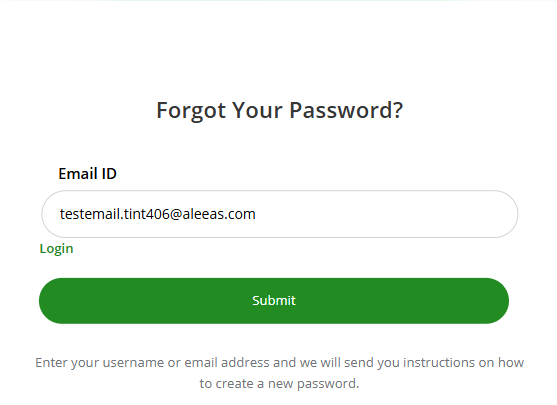
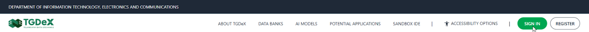

**Step 1:** Click **Forgot Password** on the Sign In page.  

  
*Click on Forgot Password*

**Step 2:** Enter your email address and submit.  

  
*Screenshot of form*

**Step 3:** Open the password reset email and click the provided link.  

[//]: # (  
*Screenshot of email*

**Step 4:** Create a new password that meets the on-screen criteria.  

[//]: # (  
*Screenshot of new password creation*

<!-- Screenshots needed for Steps 3 and 4 -->

**Step 5:** Your password will be updated. Sign in with your new password to access your dashboard.
