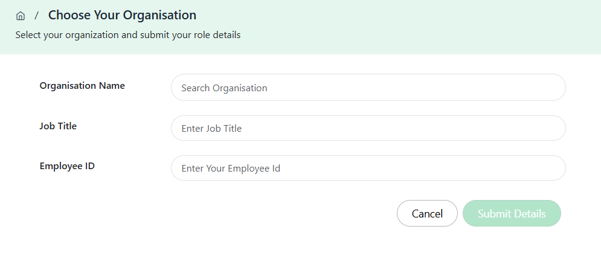
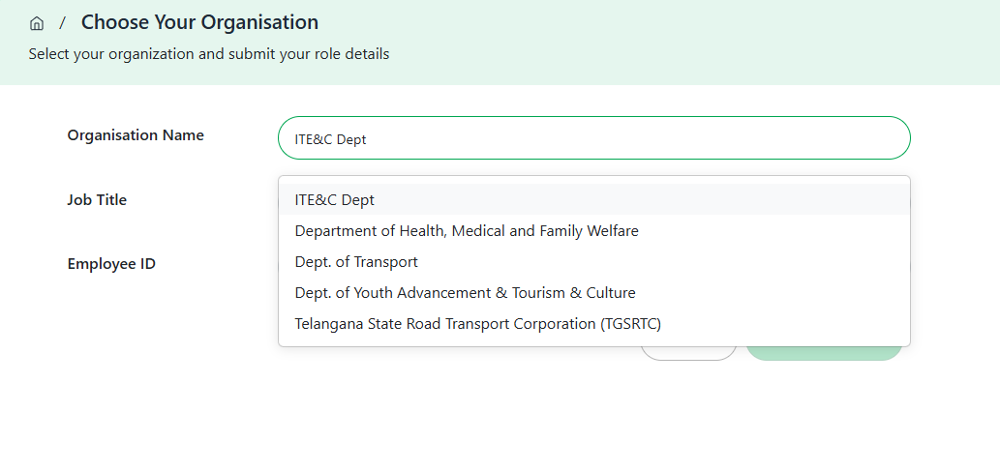
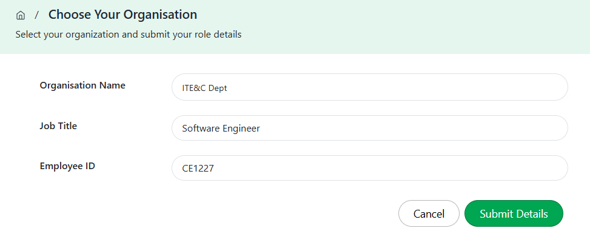

To publish Data Banks, AI Models, or Potential Applications on TGDeX, users must join an organization. By affiliating with an approved organization—such as a government department, startup, research institute, or private enterprise—users gain the **Publisher** role and the permissions required to upload and manage assets under that organization’s governance. This ensures accountability for all published content

Following are the steps to join an already registered organization on the platform.

**Step 1:** Click on the **Join an Organisation** button on your dashboard.  
  
*Accessing Join Organisation from the Dashboard*

**Step 2:** You’ll be redirected to the "Join Your Organisation" form.  
  
*Join Organisation Form*

**Step 3:** From the dropdown, select your organisation from the list of registered entities.  
  
*Selecting Organisation Name*

**Step 4:** Fill in your role details:
- **Job Title:** Enter your current designation
- **Employee ID:** Enter your official employee ID associated with the organisation

**Step 5:** Click **Submit Details** once all required fields are completed.  
  
*Entering Job Title and Employee ID*

**Step 6:** After submission, your request will be sent to the Organisation Manager for review. Once approved, your user profile will be affiliated with your organization.
