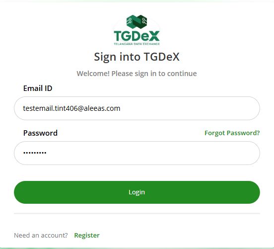
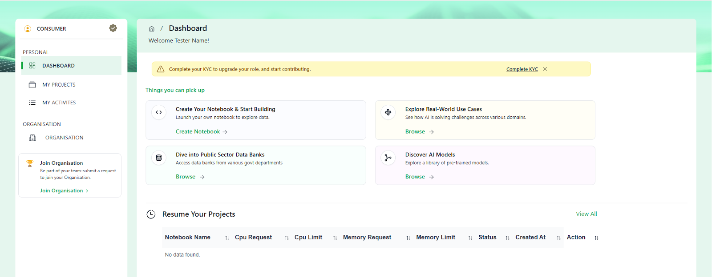

**Step 1:** Click **Sign In** on the Home Page.  

  
*Clicking on Sign In button*

**Step 2:** Enter your email address and password.

  
*Screenshot of form*

**Step 3:** Enter the verification code sent to your email, then click **Submit**.

[//]: # (
*Clicking Register button*

[//]: # (
*Clicking Register button*

<!-- // image for Step 3 missing-->

**Step 4:** Access your dashboard — once verified, you’ll be redirected to the dashboard for your assigned role.  

  
*Post login dashboard*
