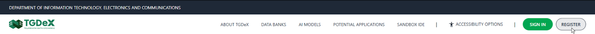
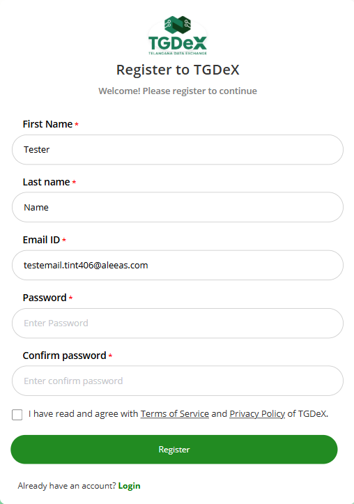
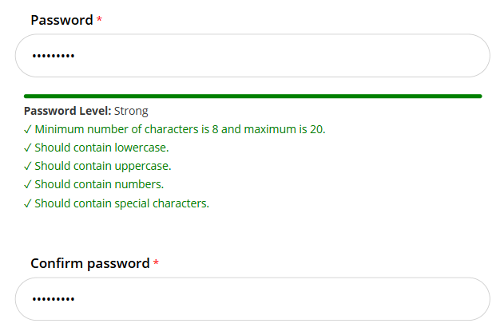
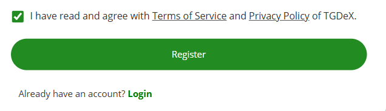
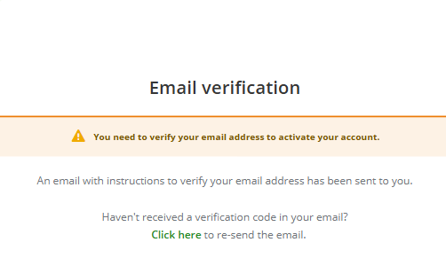
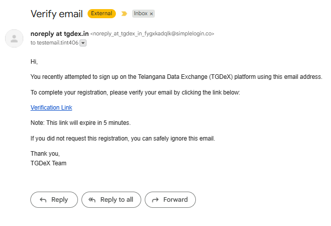

# Registration Process for Users

## Steps to Register a User:

**Step 1:** Click **Register** on the Home Page.  

  
*Clicking Register button*

**Step 2:** Enter your full name and email address.  

  
*Entering Some Details*

**Step 3:** Create a strong password that meets the on-screen requirements.  

  
*Creating Password*

**Step 4:** Agree to the [Terms of Service](https://tgdex.telangana.gov.in/terms-of-service) and [Privacy Policy](https://tgdex.telangana.gov.in/privacy-policy) by checking the consent box. 

  
*Agreement*

**Step 5:** Verify your email by clicking the link sent to your inbox.  

  
*Email Verification*

*Email received on user’s entered email address*

**Step 6:** Access your dashboard — after verification, you’ll be signed in automatically with the default **Consumer** role.  

  
*Post-login consumer dashboard*
