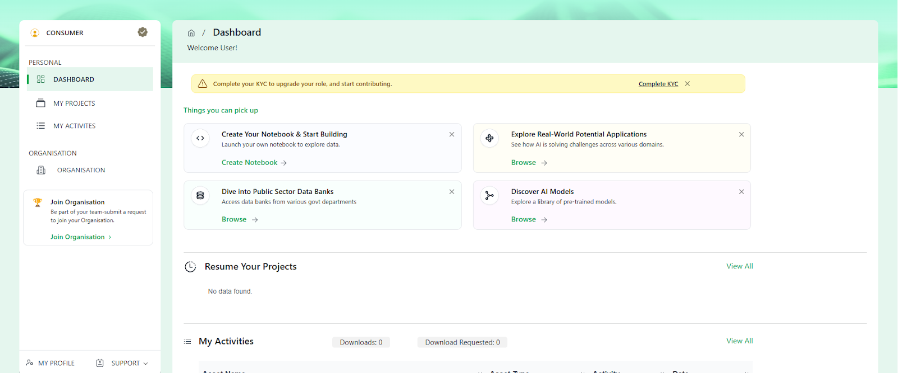
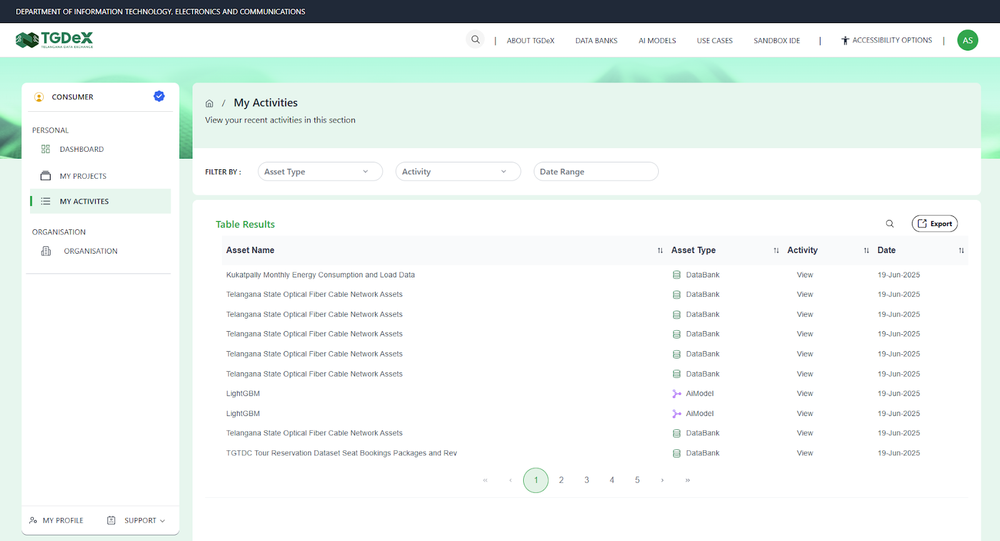
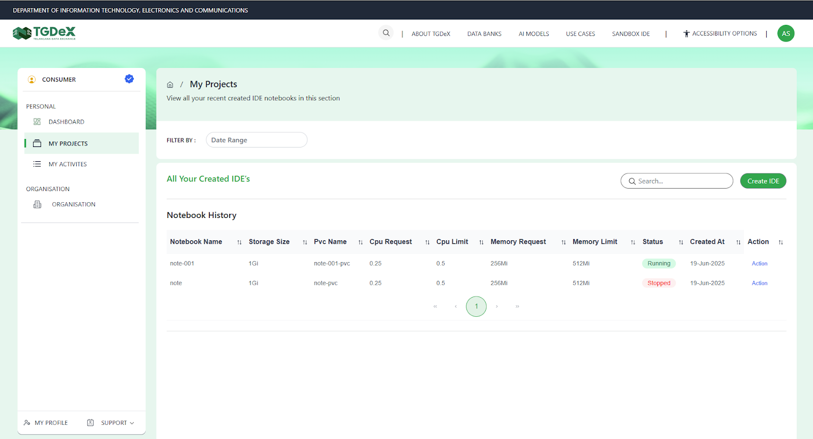

# Consumer / Consumer with Compute

---

## Access and Permissions

Consumers can:
- Browse and search Data Banks, AI Models, and Potential Applications
- View asset details
- Download open assets
- Request access to restricted assets
- Create and run notebooks for exploratory data analysis and building basic models
- (Consumers with compute) Request GPU-hour credits for advanced model training

---

## Consumer-specific Screens

- View your personal dashboard

- View/download activity history

- View/Resume past projects

