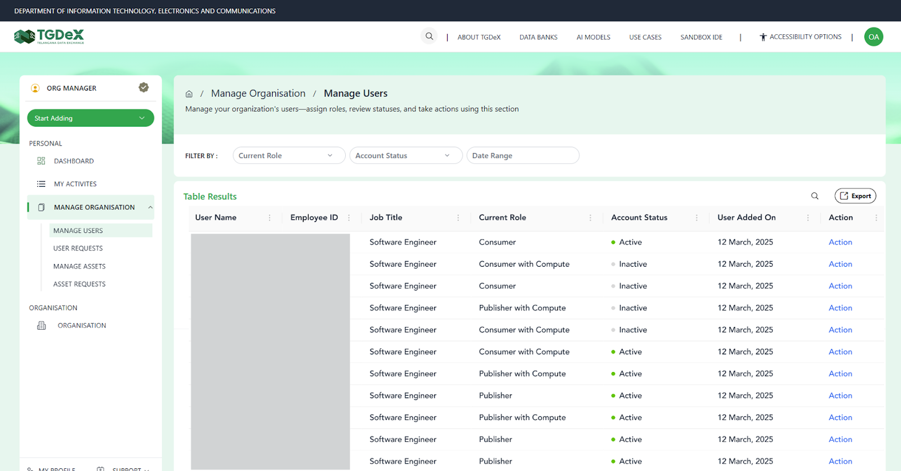
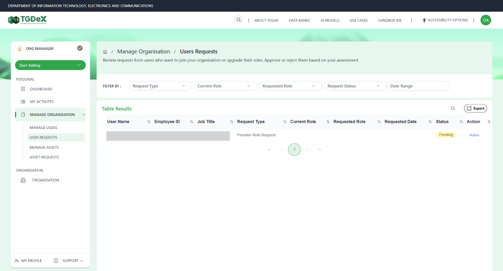
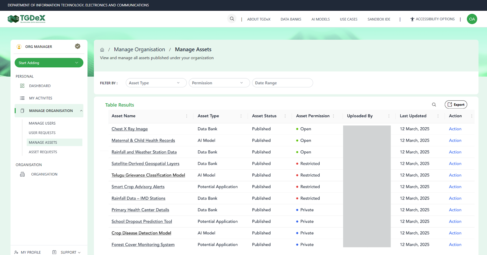
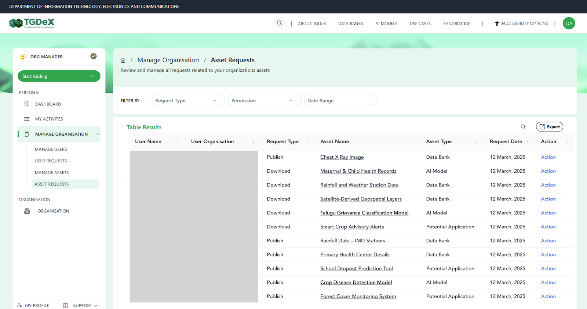

# Organization Manager

---

## Core Functions

Organisation Managers hold administrative control for their organisation’s presence on TGDeX. They are responsible for:
- Managing the organisation’s user base (add/remove users, assign roles)

- Reviewing and approving asset access requests (downloads or publication)

- Maintaining the organisation profile and ensuring compliance with TGDeX policies
